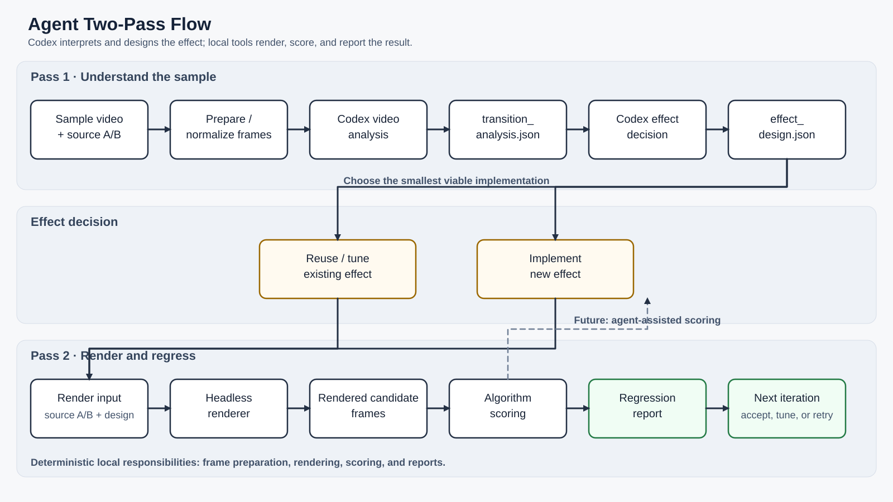

# Transition Effect Agent

`agent` is the Codex-driven layer for designing and evaluating A/B video
transitions for the `OverlayTrEngine` runtime.

The project is intentionally split into two responsibilities:

- Codex performs visual interpretation and effect-design decisions.
- Local Python and native tools perform frame preparation, rendering, scoring,
  and reporting.

This separation keeps model reasoning flexible while keeping execution and
regression results deterministic and repeatable.

## Goal

Given a short sample transition video, the long-term goal is to produce a
validated transition effect for the target runtime:

```text
sample video
    -> transition analysis
    -> effect design decision
    -> render candidate
    -> score against reference
    -> regression report
    -> validated HLSL/C++ effect
```

The final HLSL/C++ generation stage is deliberately deferred until the local
render-and-score path can evaluate candidates reliably.

## Two-Pass Flow

### Pass 1: understand the sample

Codex inspects the sample video and produces a structured
`transition_analysis` artifact containing the visible effect family, timing,
transition window, evidence, confidence, and limitations.

The analysis is not generated by the old deterministic harness analyzer. The
sample video is the primary source of truth, and uncertainty must be recorded
when the video is ambiguous.

### Pass 2: render and regress

Codex reads the analysis artifact and produces an `effect_design` artifact. It
chooses the smallest viable strategy:

- reuse an existing effect;
- tune an existing effect; or
- implement a new effect.

Local tooling then prepares the A/B inputs, invokes the headless renderer, and
scores the rendered frames against the prepared reference transition. The
current scoring stage is algorithmic. Agent-assisted scoring can be added
later as a second opinion without replacing the baseline metrics.



## Current Status

The repository contains the design contracts and prompts for the Codex portion
of the workflow, plus the first local execution slice:

- `prompts/codex_transition_analysis_prompt.md` describes the analysis-only
  pass.
- `prompts/codex_transition_analysis_schema.json` defines the
  `transition_analysis` JSON contract.
- `prompts/effect_design_prompt.md` describes the analysis-to-design decision.
- `prompts/effect_design_schema.json` defines the `effect_design` JSON
  contract.
- `docs/new_agent_flow.svg` documents the complete intended workflow.
- `src/agent_app/` provides the thin local orchestration layer.
- `tests/` contains focused tests for scoring, report assembly, and code generation.

The local execution layer reuses the existing `harness` implementation through
an explicit bridge. It does not import the old analyzer or planner.

## Runtime Environment

Run local agent commands through the existing Conda environment:

```powershell
conda run -n harness python agent/src/main.py <command>
```

Do not rely on `conda activate` persisting between Codex command processes.
The `harness` environment provides the required Python dependencies and
`ffmpeg` for PNG scoring. In the command examples below, replace each
`python agent/src/main.py` prefix with `conda run -n harness python agent/src/main.py`.

## First Local Commands

Run these commands from `D:\\AI_Harness`:

```powershell
python agent/src/main.py --help
python agent/src/main.py prepare `
  --source-video harness/examples/sample_glitch.mp4 `
  --output-dir agent/work/reference_transition `
  --target-frame-count 30

python agent/src/main.py prepare-sources `
  --source-video harness/examples/sample_glitch.mp4 `
  --output-root agent/work/glitch_sources `
  --start-frame 0 `
  --end-frame 29 `
  --frame-count 30

python agent/src/main.py retrieve `
  --analysis agent/examples/sample_glitch.transition_analysis.json `
  --output agent/work/sample_glitch_retrieval.json

python agent/src/main.py benchmark `
  --analysis agent/examples/sample_glitch.transition_analysis.json `
  --source-a agent/work/glitch_sources/source_a `
  --source-b agent/work/glitch_sources/source_b `
  --reference-transition agent/work/glitch_benchmark/reference `
  --output-root agent/work/glitch_benchmark `
  --output agent/work/glitch_benchmark/benchmark_report.json `
  --family glitch `
  --ffmpeg C:/Users/albert_hsu.CLT/AppData/Local/miniconda3/envs/harness/Library/bin/ffmpeg.exe
```

## Sample Workspaces

Keep every input video in its own workspace under `agent/work/samples/`. This
prevents reference frames, analysis JSON, generated effects, candidate sources,
and evaluation artifacts for separate videos from being mixed together.

Create a workspace before preparing the sample. This records the original video
path without copying the video, then creates `reference/`, `sources/`,
`analysis/`, `design/`, `jobs/`, `effects/`, `candidates/`, and `reports/`:

```powershell
conda run -n harness python agent/src/main.py sample-init `
  --sample-id example_20260721 `
  --source-video "D:\\input\\example.mp4"
```

Use lowercase letters, digits, `_`, and `-` in the sample ID. For this example,
all work stays under `agent/work/samples/example_20260721/`:

```powershell
conda run -n harness python agent/src/main.py prepare `
  --source-video "D:\\input\\example.mp4" `
  --output-dir agent/work/samples/example_20260721/reference

# After Codex has identified the stable A/B source boundaries.
conda run -n harness python agent/src/main.py prepare-sources `
  --source-video "D:\\input\\example.mp4" `
  --output-root agent/work/samples/example_20260721/sources `
  --start-frame <A-frame> `
  --end-frame <B-frame> `
  --frame-count 60
```

Save Codex output as `analysis/transition_structure.json` and
`design/effect_design.json`. Place the render job in `jobs/render_job.json`,
the generated package in `effects/<effect-name>/`, and its refinement workspace
in `candidates/<effect-name>/`. FX IDs remain global in `OverlayTrEngine`, so
assign each newly generated effect a unique ID such as
`ModelGenerated\\SeamlessSliding_03` even when the sample workspaces are
separate.

The `render` command accepts the existing harness render-job JSON contract. A
Codex-produced `effect_design.json` is kept alongside the job and is consumed
by `build-job` and the later report step; it is not silently converted into a
deterministic planner decision.

```powershell
python agent/src/main.py render `
  --job harness/examples/render_job.sample.json `
  --output-root agent/work

python agent/src/main.py build-job `
  --analysis agent/artifacts/transition_analysis.json `
  --design agent/artifacts/effect_design.json `
  --source-a harness/examples/inputs/source_a_clean `
  --source-b harness/examples/inputs/source_b_clean `
  --reference-transition agent/work/reference_transition `
  --output agent/work/agent_render_job.json

python agent/src/main.py score `
  --candidate agent/work/<run>/artifacts `
  --reference agent/work/reference_transition `
  --output agent/work/<run>/reports/score.json `
  --width 1920 --height 1080 `
  --frame-start 24 --frame-end 42

python agent/src/main.py report `
  --analysis agent/artifacts/transition_analysis.json `
  --design agent/artifacts/effect_design.json `
  --render-report agent/work/<run>/render_report.json `
  --score-report agent/work/<run>/reports/score.json `
  --output agent/work/<run>/reports/regression_report.json
```

When a reference sequence includes stable pre/post-transition frames, use
`--frame-start` and `--frame-end` (inclusive) to add a `transition_window`
metric block. The full-sequence metrics remain for compatibility, while the
window metrics drive shader regression. `endpoint_checks` reports the three
frames immediately before and after the selected window; adjust with
`--endpoint-frame-count`.

When `--frame-count` is omitted, `build-job` reads
`reference_transition_manifest.json` and uses its normalized frame count. It
falls back to 30 only when no reference manifest is available. This keeps the
candidate render aligned with the prepared reference sequence.

The native renderer is optional for the first setup check. Without a renderer,
`render` records the request and returns `blocked`; with a built renderer it
produces candidate PNG frames. Non-BMP preparation and scoring require
`ffmpeg`.

`prepare-sources` extracts the A and B stills at the boundaries supplied by the
analysis artifact, repeats them into equal-length frame sequences, and writes
`source_pair_manifest.json`. It does not guess transition boundaries itself.

`retrieve` queries the existing `harness` effect catalog using the analysis
artifact's recommended family. Retrieval reports the selected built-in effect,
match kind, source documents, and whether the requested FX ID matched exactly.

`benchmark` evaluates every built-in catalog entry in a family against the same
reference. Its ranked report is evidence for retrieval and tuning decisions;
it does not change the selected effect automatically. Multiple catalog records
may refer to the same runtime FX ID, so both the catalog effect ID and resolved
FX ID are retained in the report.

`generate` creates an isolated C++ wrapper, HLSL shader, and manifest from a
supported effect template. The first generator supports IDs in the
`ModelGenerated\\Dissolve_XX` family:

```powershell
python agent/src/main.py generate `
  --design agent/examples/generated_dissolve.effect_design.json `
  --output-dir agent/work/generated_dissolve_01 `
  --manifest agent/work/generated_dissolve_01/manifest.json
```

`register` is a separate, explicit step. It copies the generated sources into
`OverlayTrPlugInFx`, adds the FX table and switch registration, and updates the
Visual Studio project. It refuses duplicate FX IDs, existing destination files,
or missing source anchors.

```powershell
python agent/src/main.py register `
  --manifest agent/work/generated_dissolve_01/manifest.json `
  --target-root overlaytrengine
```

### Refining A Registered Effect

After an FX ID has been registered, refinement does not create another FX ID
and does not invoke `register` again. Initialize an isolated candidate workspace
from the registered files:

```powershell
python agent/src/main.py candidate-init `
  --manifest agent/work/boss_seamless_sliding_02_generated/manifest.json `
  --output-dir agent/work/candidates/SeamlessSliding_02
```

Codex may then edit only the candidate C++/HLSL files under that directory.
Use `prompts/codex_effect_refinement_prompt.md` with the transition analysis,
effect design, latest render report, score report, and candidate source files.
The candidate keeps the existing ID:

```text
ModelGenerated\\SeamlessSliding_02
```

Build and render the candidate after each Codex edit. Promotion is explicit and
backs up the currently registered source files first:

```powershell
python agent/src/main.py candidate-promote `
  --manifest agent/work/candidates/SeamlessSliding_02/candidate_manifest.json `
  --backup-dir agent/work/candidates/SeamlessSliding_02/backups/iteration_001

msbuild overlaytrengine/OverlayTrPlugInFx/OverlayTrPlugInFx.vcxproj `
  /p:Configuration=Debug /p:Platform=x64 /m
```

Do not promote a candidate until it compiles, renders, and has been compared
against the same reference sequence. Candidate history belongs under the
candidate workspace; the runtime FX ID remains unchanged.

Use `candidate-evaluate` to stage the candidate into the registered source
locations, build and render it, score the result, and write an iteration report.
By default, the candidate sources and rebuilt Debug plugin DLL remain staged so
you can open `OverlayTrTool` and inspect the effect. Add `--restore` when an
isolated evaluation should put the registered source files and Debug DLL back
afterward:

```powershell
python agent/src/main.py candidate-evaluate `
  --manifest agent/work/candidates/SeamlessSliding_02/candidate_manifest.json `
  --job agent/work/generated_boss_job.json `
  --reference agent/work/boss_reference `
  --output-root agent/work/candidates/SeamlessSliding_02/evaluations `
  --backup-dir agent/work/candidates/SeamlessSliding_02/backups/evaluation_001 `
  --width 1920 --height 1080
```

The evaluation command requires `msbuild`, the native renderer, and a job whose
`fx_id` is the registered candidate ID. Each evaluation still creates a backup
under `--backup-dir`; use `candidate-promote` only when you want to promote a
reviewed candidate independently of evaluation.

Each successful render also encodes its PNG sequence as
`artifacts/rendered_transition.mp4` at the render job's FPS. The MP4 is for
quick visual review; scoring continues to use the original PNG frames. The
command finds `ffmpeg` on `PATH`, or accepts an explicit `--ffmpeg` path.

Successful `candidate-evaluate` runs additionally write these review assets in
the same `artifacts` directory:

- `reference_transition.mp4`
- `comparison_side_by_side.mp4`
- `comparison_transition_window.mp4`

The score report also includes `transition_diagnostics` with the five worst MSE
frames and five lowest-SSIM frames in the configured transition window.

For a transition window, scoring uses OpenCV dense optical flow to compare
per-pixel 2D motion and dynamically derived motion regions. `motion_metrics`
records vector error, direction agreement, region overlap, and a combined
`motion_similarity` score. The dependency-free horizontal-band scorer remains
only as a fallback when OpenCV is unavailable. These metrics complement, but
do not replace, visual review for dissolves, masks, noise, or severe occlusion.
Forward/backward flow consistency yields `reliable_motion_coverage`, so the
controller can distinguish reliable motion evidence from ambiguous regions.

When OpenCV motion scoring succeeds, the candidate artifacts also contain
`motion_diagnostics/frame_XXXX.png` and `motion_diagnostics.mp4`. Each panel
shows reference flow, candidate flow, and a vector-error heatmap for one pair
of transition frames. The controller includes the latest diagnostic video in
the next Codex refinement packet.

### Stateful refinement loop

The controller keeps candidate-local history in `candidate_state.json`. It does
not invoke Codex itself; it prepares the bounded iteration packet, tracks the
accepted baseline, and records the result after the candidate is evaluated.

First select the verified baseline:

```powershell
conda run -n harness python agent/src/main.py candidate-set-baseline `
  --manifest agent/work/candidates/SeamlessSliding_02/candidate_manifest.json `
  --iteration 5 `
  --report agent/work/candidates/SeamlessSliding_02/evaluations/<baseline-run>/reports/candidate_iteration_report.json
```

The command snapshots the candidate source files under
`baselines/iteration_XXX/`. If the selected baseline must be reconstructed
from an evaluation backup, pass that backup directory through `--source-dir`.
After a rejected or tradeoff iteration has been reviewed, restore the selected
baseline before starting a new hypothesis:

```powershell
conda run -n harness python agent/src/main.py candidate-restore-baseline `
  --manifest agent/work/candidates/SeamlessSliding_02/candidate_manifest.json
```

Then prepare the next bounded refinement request:

```powershell
conda run -n harness python agent/src/main.py candidate-next `
  --manifest agent/work/candidates/SeamlessSliding_02/candidate_manifest.json `
  --analysis agent/work/boss_transition_structure.json `
  --design agent/work/boss_effect_design.json `
  --max-iterations 20 `
  --max-rejected 8
```

When the scoring method changes materially, retain the existing history and
start a new bounded phase instead of mixing incompatible budgets or metrics.
For example, the optical-flow phase uses the re-scored iteration 5 baseline:

```powershell
conda run -n harness python agent/src/main.py candidate-start-phase `
  --manifest agent/work/candidates/SeamlessSliding_02/candidate_manifest.json `
  --name optical_flow `
  --baseline-iteration 5 `
  --report agent/work/optical_flow_score_baseline_v2.json `
  --source-dir agent/work/candidates/SeamlessSliding_02/backups/evaluation_024 `
  --max-iterations 5 `
  --max-rejected 3
```

`candidate-next` then uses the active phase's budgets and only blocks a
hypothesis category after three rejections in that phase. The full previous
history remains in each packet for context.

Read the emitted `iteration_XXX_codex_request.md` in the candidate `packets`
folder and use it as the Codex editing request. Codex edits only the candidate
workspace and adds one `iteration_XXX_*.json` record with a
`hypothesis_category`. Evaluate that edit with `candidate-evaluate --iteration
XXX`; the controller classifies it as `accepted`, `tradeoff`, or `rejected` and
updates the selected baseline only for accepted results.

Use `candidate-status --manifest <candidate_manifest>` to inspect the current
baseline, evaluation history, and blocked categories. Three rejected trials in
one category block that category from future packets. The selection policy
requires exact endpoint checks. It accepts a material improvement in SSIM, MSE,
or motion similarity only when the other comparable metrics remain within
guardrails. Improvements with a meaningful regression are recorded as
`tradeoff` entries in the candidate-local shortlist rather than silently
replacing the baseline.

Use `candidate-record-score` to attach a new score report to an existing
iteration's already-rendered artifacts. This is useful when scoring metrics are
improved without changing the shader or rebuilding the plugin:

```powershell
conda run -n harness python agent/src/main.py candidate-record-score `
  --manifest agent/work/candidates/SeamlessSliding_02/candidate_manifest.json `
  --iteration 9 `
  --report agent/work/candidates/SeamlessSliding_02/evaluations/<run>/reports/motion_score.json
```

After registration, build the plugin, stage the DLL through the existing
deployment flow, render with the headless renderer, and score the candidate
before treating the effect as validated.

Generated effects that require runtime resources must keep the existing
deployment convention. Source resources belong under
`overlaytrengine/OverlayTrPlugInFx/Resource/<effect-folder>/`; the built
runtime copy is staged under
`overlaytrengine/x64/Debug/Resource/<effect-folder>/` or the corresponding
Release directory. The plugin first checks the supplied input folder and then
falls back to the DLL-relative `Resource` directory, so no new production
interface is required.

New-effect execution is gated by the analysis artifact. The planner hint must
set `implementation_status` to `supported`; `review_required` and
`unsupported` stop `build-job` before rendering or deployment.

`build-job` supports `reuse_existing_effect`, `tune_existing_effect`, and the
first constrained `implement_new_effect` path. Generated designs must provide
`target_effect.effect_id`; existing-effect designs may provide either
`target_effect.effect_id` or `target_effect.closest_existing_effect_id`.

## Related Projects

This workspace contains two existing projects used by the future pipeline:

- [`../harness`](../harness): Python orchestration, frame preparation,
  rendering requests, scoring, and the headless C++ renderer shim.
- [`../overlaytrengine`](../overlaytrengine): the Visual Studio/C++ target
  runtime that builds `OverlayTrEngine.dll` and `OverlayTrPlugInFx.dll`.

The workspace root is not the Git repository for either project. Run Git
commands inside the repository you intend to change.

## Planned Implementation Order

1. Validate the current local slice with an existing built-in transition
   effect.
2. Add retrieval of existing effects before considering new implementation.
3. Expand constrained HLSL/C++ generation beyond the dissolve baseline.
4. Register and ship new effects in `overlaytrengine` only after their build,
   runtime integration, and regression results are recorded.

## Design Constraints

- Keep Codex artifacts machine-readable and schema-validated.
- Keep video preparation, rendering, and scoring local and reproducible.
- Design scoring for arbitrary 2D motion and unknown spatial regions. Do not
  treat a fixed band count or horizontal-only displacement as a general
  transition model; such measures are diagnostics or fallbacks only.
- Prefer established, maintained vision libraries when they improve scoring
  fidelity. The `harness` Conda environment may gain runtime dependencies when
  they are justified and documented.
- Prefer an existing target effect when it is a credible match.
- Do not generate open-ended shader code before visual evaluation exists.
- Record confidence and limitations instead of inventing observations.
- Do not treat a similarity score as proof of visual equivalence; use it as a
  regression signal alongside visual inspection.

## Development Notes

Python commands and native renderer details currently live in
`harness/AGENTS.md` and `harness/README.md`. The first implementation task in
this repository should establish the minimum `agent` package and its test
fixtures, rather than copying the old analyzer and planner wholesale.
